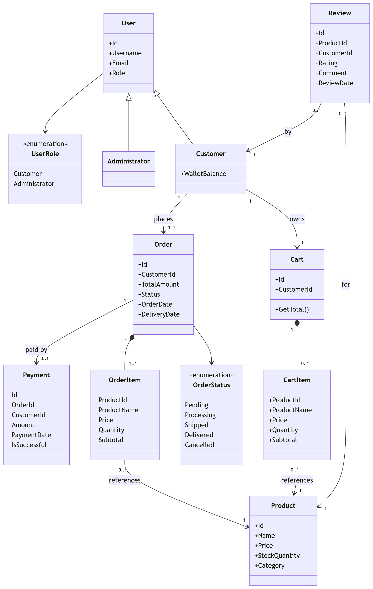

# Online Shopping Backend System

## What is the Online Shopping Backend System?

The **Online Shopping Backend System** is a C# console-based application that simulates the core functionality of an e-commerce platform. It allows customers to browse products, manage a shopping cart, place orders, and track purchases, while administrators manage products, orders, and reports.

The system demonstrates fundamental backend programming concepts including:

- Object-Oriented Programming (OOP)
- Clean code practices
- LINQ queries
- Exception handling
- Menu-driven console interaction
- Data persistence using JSON files

The goal of this project is to implement a **simple but structured backend system** that models the typical workflow of an online store.

---

# Documentation

## Software Requirement Specification

### Overview

The system supports two primary user roles:

- **Customer**
- **Administrator**

Customers can browse products, add items to a cart, place orders, and review purchased products.

Administrators manage the product catalog, monitor orders, update order statuses, and generate sales reports.

The application runs as a **console-based program** and stores data locally using JSON persistence.

---

## Components and Functional Requirements

### 1. Authentication and Authorization

Users interact with the system through login and registration functionality.

Features include:

- User registration
- User login
- Role-based access (Customer / Administrator)

---

### 2. Product Management

Administrators manage the product catalog.

Features include:

- Add new products
- Update product details
- Delete products
- Restock product inventory
- View all products

---

### 3. Product Browsing and Searching

Customers can view and search available products.

Features include:

- View product catalog
- Search products using LINQ queries
- Filter products by criteria

---

### 4. Shopping Cart Management

Customers can manage their shopping cart.

Features include:

- Add products to cart
- Update product quantities
- View cart contents
- Remove items from cart

---

### 5. Payment and Wallet System

Customers use a simulated wallet to pay for orders.

Features include:

- View wallet balance
- Add funds to wallet
- Pay for orders using wallet balance

---

### 6. Order Management

Customers can place and track orders.

Features include:

- Checkout cart
- Generate order records
- Track order status
- View order history

Administrators can:

- View all orders
- Update order status

---

### 7. Reviews and Feedback

Customers can review products after purchase.

Features include:

- Submit product reviews
- View reviews for products

---

### 8. Reporting and Analytics

Administrators can generate reports about the system.

Features include:

- View low stock products
- Generate sales reports
- View overall order activity

LINQ is used to perform filtering, sorting, and aggregation operations.

---

# Design

## System Architecture

The application follows a **layered console architecture** to separate responsibilities and maintain clean code structure.

```
Program
|
|-- Menus
|     Handles console interaction
|
|-- Services
|     Business logic
|
|-- Models
|     Core domain entities
|
|-- Interfaces
|     Contracts for services
|
|-- Data
|     Persistence and seed data
|
|-- Helpers
|     Utility functions
|
|-- Enums
      Application constants
```

---

## Domain Model
The project uses a domain-first model around users, catalog, cart, orders, payments, and reviews.



## Design Choices
Key design decisions:

- Layered structure: menus (presentation), services (business logic), models/enums (domain), data/persistence (storage)
- Interface-driven services: contracts in `OnlineShoppingSystem/Interfaces` with implementations in `OnlineShoppingSystem/Services`
- Explicit role flow: customer and admin actions are separated to keep each path focused and safer
- JSON persistence: simple and portable storage for a console project (`users`, `products`, `carts`, `orders`, `payments`, `reviews`)
- Seed initialization: app can start with usable sample data via `SeedData` when storage is empty

Why this works well for this project:

- Keeps business rules testable without UI coupling
- Keeps features extensible (new commands, reports, validations)
- Avoids over-engineering while still demonstrating strong architecture

## Advanced Features: Admin Dashboard
The admin dashboard (`ViewDashboardCommand`) provides operational and business insight in one screen.

It includes:

- User stats: total customers, administrators, and users
- Inventory health: total products, low-stock count, out-of-stock warnings
- Order pipeline: pending, processing, delivered counts
- Financial metrics: revenue, units sold, average order value
- Recent activity: latest orders with status highlighting
- Alerts section: low stock, out-of-stock, and pending-order alerts
- Top products: ranked by revenue from completed/non-cancelled sales

This gives an admin a quick "state of the store" snapshot without navigating multiple menus.

## Design Patterns Used
The implementation uses practical patterns that match the problem:

- `Factory Pattern`
- `UserFactory`: creates `Customer` or `Administrator` based on role
- `MenuFactory`: routes authenticated users to the correct menu flow

- `Command Pattern`
- Menu actions are encapsulated in command classes implementing `ICommand`
- `CustomerMenu` and `AdministratorMenu` act as invokers, reducing large switch/if menu blocks

- `Strategy Pattern`
- Reporting uses `IReportStrategy` with concrete strategies like `SalesSummaryStrategy`, `TopProductsStrategy`, and `SalesByCategoryStrategy`
- `ReportGenerator` executes selected strategies at runtime

- `Singleton Pattern`
- `AppDataStore` provides a shared in-memory data source and ID sequencing across services

## Testing
Unit tests are included in `OnlineShoppingSystem.Tests` using `xUnit`.

Current tested areas include:

- Factories (`UserFactory`)
- Validators (`ProductValidator`)
- Strategies (report strategies)
- Data store (`AppDataStore` singleton behavior)
- Services (`ProductService` business logic)

Run tests from the repository root:

```bash
dotnet test
```
## Running the Application
Requirements:

- .NET 8+
- Visual Studio 

Navigate to OnlineShoppingSystem:

```bash
dotnet run 
```

## Repository Structure

```text
OnlineShoppingSystem/
      Commands/
      Configuration/
      Data/
      Enums/
      Factories/
      Helpers/
      Interfaces/
      Menus/
      Models/
      Services/
      Strategies/
      Validators/

OnlineShoppingSystem.Tests/
```